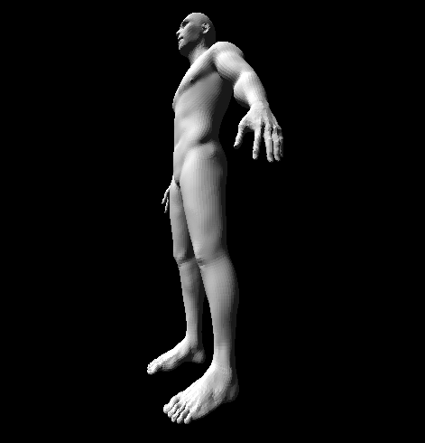
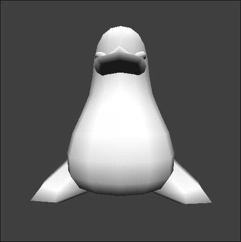
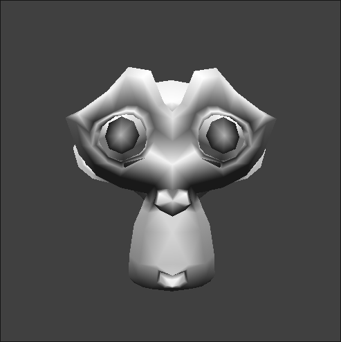
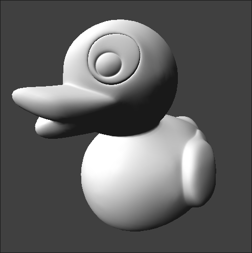

# 3D Renderer

 
 

This is a 3D renderer written in C using SDL2.

## Features
* Wavefront (.obj) files loading
* Z buffering
* Back face culling
* Camera movement
* Runtime rendering
* Mesh rotation
* Light interpolation

## Build
```sh
git clone https://github.com/chalettt/3DR.git
cd 3DR && make
```
SDL2 needs to be installed for this project to be built.

## Usage
If launched without arguments, the default cube will be loaded.

```sh
./3DR my_awesome_wavefront_file.obj
```

### Flags
*  -x/y/z Changes mesh coordinates
*  -s Scales the mesh
```sh
./3DR my_awesome_wavefront_file.obj -x 1 -y 2 -z 3 -s 10
```

### Inputs
* Rotation: mouse movements
* Pan mesh: mouse hold
* Up/Down: <kbd>Space</kbd> <kbd>Shift</kbd> 
* Font/Rear/Left/Right: <kbd>W</kbd> <kbd>S</kbd> <kbd>A</kbd> <kbd>D</kbd>

## Documentation
Each header file contains a doxygen documentation, you can run the following command to generate the full documentation (which will generate in /docs):
```sh
make doc
```
